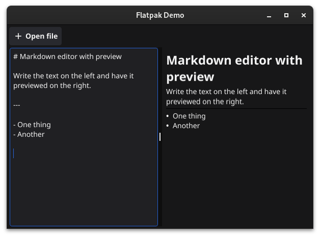
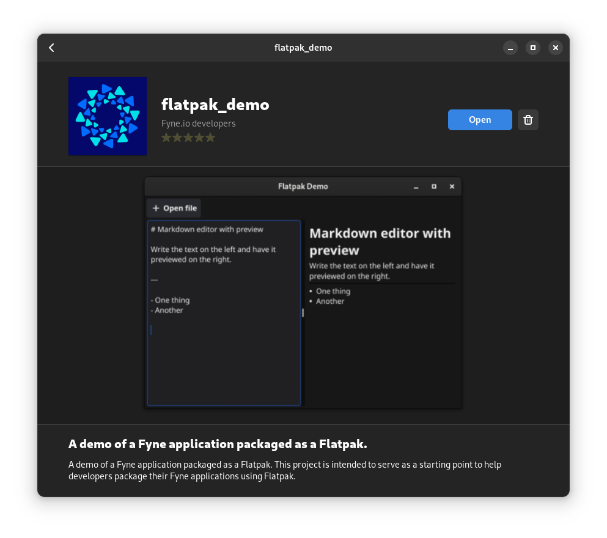

# flatpak_demo
A demo of a Fyne application packaged as a Flatpak. This project is intended to serve as a starting point to help developers package their Fyne applications using Flatpak.





## Requirements
Both `flatpak` and `flatpak-builder` need to be installed in order to build the packages. Commands for installing Flatpak can be found [here](https://flatpak.org/setup/). Installing the builder should be very similar.
More information about how to build Flatpaks can be found [here](https://docs.flatpak.org/en/latest/first-build.html) and [here](https://docs.flatpak.org/en/latest/building.html).

With that installed, we need to first get the [flathub](https://flatpak.org) repository set up.
```
flatpak remote-add --if-not-exists flathub https://flathub.org/repo/flathub.flatpakrepo
```

We can now move on to installing the development SDKs that we are going to use:
```
flatpak install flathub org.freedesktop.Platform//23.08 org.freedesktop.Sdk//23.08 org.freedesktop.Sdk.Extension.golang//23.08
```

## Building and installing

Building the package can be done with the following command:
```
flatpak-builder --user --force-clean build-dir io.fyne.flatpak_demo.yml
```

The package can also be built and installed in one step, using the following command:
```
flatpak-builder --user --install --force-clean build-dir io.fyne.flatpak_demo.yml
```

## Running
The installed package can then be started by running the following command:
```
flatpak run --user io.fyne.flatpak_demo
```

## Vendoring
It is possible to enable network access during the build, but it is recommended to not do so. If you want to publish the package to [flathub](https://flathub.org), it is even a requirement.
For that reason, it is a good idea to vendor the project using `go mod vendor` and add the files to the git repo or use tools like [flatpak-go-mod](https://github.com/dennwc/flatpak-go-mod).

## Sandbox permissions
The Flatpak applications run within a sandbox that restricts their communication with the host system. It is generally preferred to have the application be as strict as possible,
with no more permissions enabled than necessary. Our example app only opens up filesystem access for the `Documents` folder as well as the Fyne config directory to support Fyne
preferences and Fyne document storage system. Remove these if your app do not need it.
More information on avaliable permissions can be found on the [sandbox-permissions](https://docs.flatpak.org/en/latest/sandbox-permissions.html) 
and the [sandbox-permissions-reference](https://docs.flatpak.org/en/latest/sandbox-permissions-reference.html) documentation pages.

## Appdata and desktop files
Flatpak requires the application to provide metadata about itself. This data is then used in application stores like [Gnome Software](https://apps.gnome.org/en-GB/app/org.gnome.Software/), [KDE Discover](https://apps.kde.org/discover/)
and many others, to display information about the application. This metadata can easily be created using the [AppStream Metainfo Creator](https://www.freedesktop.org/software/appstream/metainfocreator/#/guiapp),
or you can use the [io.fyne.flatpak_demo.appdata.xml](https://github.com/fyne-io/flatpak_demo/blob/main/io.fyne.flatpak_demo.appdata.xml) file as a reference.

A desktop file (`.desktop`) is also required (as with any other Linux desktop application). You can let the metainfo creator above generate one for you, or you can use the [io.fyne.flatpak_demo.desktop](https://github.com/fyne-io/flatpak_demo/blob/main/io.fyne.flatpak_demo.desktop) file as a reference.

### Guidelines from Flathub
Flathub has documentation regarding their requirements and suggestions for your application metadata if you wish to publish the app there.
Most notably, the [MetaInfo guidelines](https://docs.flathub.org/docs/for-app-authors/metainfo-guidelines/) and [Quality guidelines](https://docs.flathub.org/docs/for-app-authors/metainfo-guidelines/quality-guidelines) are important to read.

## Example manifest
The manifest for this project can be found below. It can be used as a base to use when packaging other apps using Flatpak.
The sha256 field for the source can be found by downloading the file and running `sha256sum` on it.

Please note that this manifest file normally wouldn't be in the same repository as the rest of the code, but instead
part of a separate flatpak-specific repository. We have it in the same repository here for the sake of simplicity.
This manifest uses the latest release of this repository and will not get local changes.

```yml
app-id: io.fyne.flatpak_demo
runtime: org.freedesktop.Platform
runtime-version: '23.08'
sdk: org.freedesktop.Sdk
sdk-extensions:
    - org.freedesktop.Sdk.Extension.golang
command: flatpak_demo

finish-args:
    - --share=ipc # Share IPC namespace with the host (necessary for X11).
    - --socket=x11
    - --device=dri # OpenGL rendering support.

    # Only needed if building with -tags wayland.
    #- --socket=wayland

    # Needed to support desktop notifications.
    - --talk-name=org.freedesktop.Notifications

    # Allowing access to the home directory as example.
    - --filesystem=home

build-options:
  env:
    - GOBIN=/app/bin
    - GOROOT=/usr/lib/sdk/golang

modules:
    - name: flatpak_demo
      buildsystem: simple
      build-commands:
        - $GOROOT/bin/go build -trimpath -o flatpak_demo
        - install -Dm00755 flatpak_demo $FLATPAK_DEST/bin/flatpak_demo
        - install -Dm00644 Icon.png $FLATPAK_DEST/share/icons/hicolor/256x256/apps/$FLATPAK_ID.png
        - install -Dm00644 $FLATPAK_ID.desktop $FLATPAK_DEST/share/applications/$FLATPAK_ID.desktop
        - install -Dm00644 $FLATPAK_ID.appdata.xml $FLATPAK_DEST/share/appdata/$FLATPAK_ID.appdata.xml
      sources:
        - type: archive
          url: "https://github.com/fyne-io/flatpak_demo/archive/refs/tags/v1.3.0.tar.gz"
          sha256: a9d3b920404b3b699da757a9641ebc75cf43e35515dd9879622de33c6d104b63
```

### Building local code
If you want to build using the local code in the repository instead of the latest release, you can
swap out the source section in the manifest above with this:

```yml
      sources:
        - type: dir
          path: ./
```
